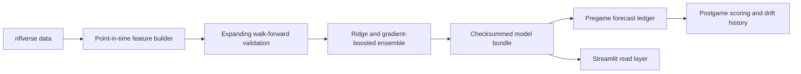

# NFL Prediction System

A point-in-time NFL forecasting system for game margins, totals, win probabilities, and player props. Version 3 rebuilds the original prototype around one rule: a forecast may use only information that existed before kickoff.

The current application is configured for the 2026 season. It loads the upcoming schedule independently from the completed seasons used for training, so preseason updates no longer fail when play-by-play for the new season does not yet exist.

## What changed in version 3

- Every historical feature is created before that game's result updates team or player state.
- Validation is chronological and expanding; no future season can train a model evaluated on an earlier season.
- Predictions are frozen in an immutable ledger and scored later without recomputation.
- Model files have an ordered feature schema, checksums, library versions, data cutoff, season metadata, and out-of-fold metrics.
- Game and player forecasts include residual uncertainty and 80% intervals.
- Receiving targets are counted before completions, and snap-count participation preserves active zero-opportunity games.
- Current prop menus use stable GSIS player IDs and exclude retired/cut players through the latest roster feed.
- Sportsbook signs are converted explicitly: a home favorite at `-6` corresponds to a `+6` market home margin.
- Manual injuries are session-only scenarios with visible availability assumptions; official injury-feed freshness is tracked separately.
- Dependencies are pinned, CI is required, and a scheduled updater opens a reviewable artifact pull request.

## Architecture



Production code lives in `nfl_prediction/`:

- `config.py`: season context, paths, and division definitions.
- `data.py`: maintained `nflreadpy` ingestion with independent optional feeds.
- `features.py`: shared game/player feature construction and leakage controls.
- `modeling.py`: walk-forward validation, learned ensemble weights, uncertainty, manifests, and verified loading.
- `pipeline.py`: atomic training, forecasting, current rosters/injuries, and artifact publication.
- `ledger.py`: immutable prediction batches and separate result records.
- `market.py`: sportsbook sign and price-probability conversions.

## Quick start

Python 3.11-3.13 is supported; CI uses Python 3.12.

```bash
python -m venv .venv
source .venv/bin/activate
python -m pip install -r requirements-dev.txt
python weekly_nfl_update.py
streamlit run app.py
```

On Windows PowerShell, activate with `.venv\Scripts\Activate.ps1`.

Validate before publishing:

```bash
ruff check .
ruff format --check .
pytest -q
```

## Data and artifacts

The updater fetches schedules, play-by-play, weekly rosters, injury reports, and snap counts through `nflreadpy`. Raw downloads are not committed. Generated read artifacts remain small enough for Streamlit deployment.

`models/manifest.json` is the source of truth for model versions and results. `data/predictions/` stores each pregame run once; completed outcomes are written to a separate `.results.json` record. JSON writes and model replacement are atomic, so the app does not read half-written releases.

Never load model bundles from an untrusted source. Checksums detect corruption, but Python model serialization is still a trusted-artifact boundary.

## Evaluation policy

Model selection uses expanding weekly splits. Production models are then fitted on every eligible row through the recorded cutoff. The manifest reports MAE, RMSE, bias, 80% interval coverage, pinball loss, latest-season holdout results, and rolling-baseline improvement. Game-margin models also report winner Brier score, log loss, and calibration error.

The app intentionally labels market analysis as paper analysis. A displayed difference is not evidence of a profitable edge. Market claims require timestamped prices, calibrated probabilities, closing-line comparisons, adequate sample size, and uncertainty-aware evaluation.

## Operations

See [MODEL_CARD.md](MODEL_CARD.md) for intended use and limitations and [docs/OPERATIONS.md](docs/OPERATIONS.md) for weekly refresh, failure, rollback, and launch procedures.

## Data attribution

This project uses nflverse data. Licensing and attribution details are in [NOTICE.md](NOTICE.md). Application code is MIT licensed.
