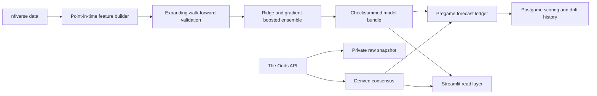

# NFL Prediction System

A point-in-time NFL forecasting system for game margins, totals, win probabilities, player props, and timestamped market comparison. Version 4 keeps the independent football model separate from The Odds API consensus so model accuracy and market disagreement can be measured honestly.

The current application is configured for the 2026 season. It loads the upcoming schedule independently from the completed seasons used for training, so preseason updates no longer fail when play-by-play for the new season does not yet exist.

## What changed in version 4

- The Odds API adapter collects NFL spreads, totals, American prices, provider timestamps, and quota headers without logging the API key.
- Book-level responses stay in ignored `data/market_private/` storage. The public `market_consensus.json` contains only median lines, prices, book counts, and dispersion.
- Sportsbook team names map to nflverse team codes, and home spreads are converted exactly once (`-6` becomes an expected home margin of `+6`).
- Snapshots after kickoff, snapshots from the future relative to a replay, and snapshots more than eight days before kickoff are rejected.
- Weekly predictions retain the independent model output and add a separately labeled market-consensus benchmark. No unvalidated blend is presented as a model improvement.
- The immutable ledger records the market timestamp and later scores model and market errors on the same games.
- A guarded workflow collects early-week, Thursday, game-day, and prime-time snapshots for two credits per live request when using one region and two markets.

## Version 3 foundation

- Every historical feature is created before that game's result updates team or player state.
- Validation is chronological and expanding; no future season can train a model evaluated on an earlier season.
- Predictions are frozen in an immutable ledger and scored later without recomputation.
- Model files have an ordered feature schema, checksums, library versions, data cutoff, season metadata, and out-of-fold metrics.
- Game and player forecasts include residual uncertainty and 80% intervals.
- Receiving targets are counted before completions, and snap-count participation preserves active zero-opportunity games.
- Current prop menus use stable GSIS player IDs and exclude retired/cut players through the latest roster feed.
- Sportsbook signs are converted explicitly: a home favorite at `-6` corresponds to a `+6` market home margin.
- Manual injuries are session-only scenarios with visible availability assumptions; official injury-feed freshness is tracked separately.
- Dependencies are pinned, CI is required, and a scheduled updater opens a reviewable artifact pull request.

## Architecture



Production code lives in `nfl_prediction/`:

- `config.py`: season context, paths, and division definitions.
- `data.py`: maintained `nflreadpy` ingestion with independent optional feeds.
- `features.py`: shared game/player feature construction and leakage controls.
- `modeling.py`: walk-forward validation, learned ensemble weights, uncertainty, manifests, and verified loading.
- `pipeline.py`: atomic training, forecasting, current rosters/injuries, and artifact publication.
- `ledger.py`: immutable prediction batches and separate result records.
- `market.py`: sportsbook sign and price-probability conversions.
- `odds.py`: provider client, quota accounting, team normalization, consensus, freshness, and private snapshot storage.

## Quick start

Python 3.11-3.13 is supported; CI uses Python 3.12.

```bash
python -m venv .venv
source .venv/bin/activate
python -m pip install -r requirements-dev.txt
python weekly_nfl_update.py
streamlit run app.py
```

On Windows PowerShell, activate with `.venv\Scripts\Activate.ps1`.

Validate before publishing:

```bash
ruff check .
ruff format --check .
pytest -q
```

## Data and artifacts

The updater fetches schedules, play-by-play, weekly rosters, injury reports, and snap counts through `nflreadpy`. Raw downloads are not committed. Generated read artifacts remain small enough for Streamlit deployment.

`models/manifest.json` is the source of truth for model versions and results. `data/predictions/` stores each pregame run once; completed outcomes are written to a separate `.results.json` record. JSON writes and model replacement are atomic, so the app does not read half-written releases.

Never load model bundles from an untrusted source. Checksums detect corruption, but Python model serialization is still a trusted-artifact boundary.

## Market snapshots

Create `.env` from `.env.example`, set `ODDS_API_KEY`, and fetch current NFL spreads and totals:

```bash
python market_update.py --dry-run
python market_update.py
```

The dry run estimates credits without contacting the provider. Current `us` spreads plus totals are budgeted at two credits. A paid historical request is explicitly gated and estimated at 20 credits:

```bash
python market_update.py --historical-at 2025-09-07T15:00:00Z --dry-run
python market_update.py --historical-at 2025-09-07T15:00:00Z --max-credits 20
```

Historical raw and consensus files remain private and ignored. Current public consensus is a small analytical summary, not a standalone odds feed. The automated workflow uses the repository secret `ODDS_API_KEY` and opens a draft pull request containing only `market_consensus.json`.

### Historical model-versus-market benchmark

The historical benchmark rebuilds the independent model's expanding-window predictions, groups games by kickoff window, and requests consensus 30 minutes before kickoff. Both the ridge/boosting component weight and any later model/market blend use only residuals from earlier validation weeks.

Estimate the exact cost before making a paid request:

```bash
python historical_market_benchmark.py \
  --training-seasons 2022-2025 \
  --evaluation-seasons 2025 \
  --weeks 1-2 \
  --max-credits 300 \
  --dry-run
```

The guarded pilot is 14 snapshots and 280 credits for 32 games. The full matching 2023–2025 OOF period is 334 snapshots and 6,680 credits for 723 eligible games. Exact team/game records and all provider responses remain under ignored `data/market_private/`; only an aggregate report containing errors, learned weights, season splits, coverage, and disagreement buckets may be published.

The completed 723-game benchmark selected a 100% market weight for future margin and total forecasts. Margin MAE was 10.383 for the independent model, 9.618 for consensus, and 9.648 for the prequential blend. Total MAE was 10.536, 10.172, and 10.199 respectively. The result supports consensus as the tighter market-informed forecast while retaining the independent model as a research signal; it does not support claiming that disagreement is a betting edge.

## Evaluation policy

Model selection uses expanding weekly splits. Production models are then fitted on every eligible row through the recorded cutoff. The manifest reports MAE, RMSE, bias, 80% interval coverage, pinball loss, latest-season holdout results, and rolling-baseline improvement. Game-margin models also report winner Brier score, log loss, and calibration error.

The app intentionally labels market analysis as paper analysis. A displayed difference is not evidence of a profitable edge. Agreement with the market usually means the independent forecast adds little actionable information; disagreement is a hypothesis to track, not a bet. Market claims require timestamped prices, no-vig probabilities, closing-line comparisons, adequate sample size, and uncertainty-aware evaluation.

## Operations

See [MODEL_CARD.md](MODEL_CARD.md) for intended use and limitations and [docs/OPERATIONS.md](docs/OPERATIONS.md) for weekly refresh, failure, rollback, and launch procedures.

## Data attribution

This project uses nflverse data. Licensing and attribution details are in [NOTICE.md](NOTICE.md). Application code is MIT licensed.
